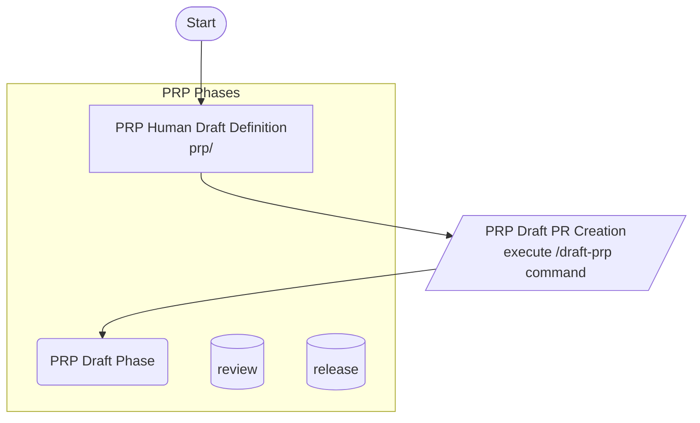

A. Initiation
    1. Human identifies need for a PRP.
    2. Human creates PRP definition file in prp/ directory.
        - Filename: <PRP_NAME>-definition.md
    3. Human populates definition with context, goals, requirements.
A. PRP Draft Phase
    # The purpose of this phase is to generate a draft PRP based on the provided definition and ensure that industry standards and best practices are being followed. This is the first phase of industry and standards alignment.
    - Validate draft prp proposal
    - Review context and requirements
    - Research standards and best practices (WebSearch, internal docs)
    - Ensure alignment with industry standards
    2. Human runs `/draft-prp` command to create draft PR from definition.
        - draft-prp takes stdin and file inputs.
    3. System gathers relevant information, context files, standards, templates.
    4. Submit data to Anthropic Batch API for draft PR generation.
    5. System creates draft PR with generated content.
    6. Draft PRP created and commited to repository. via git actions
        - Draft PRP stored in prp/drafts
        - Original saved in prp/archive
        - DRAFT-<FILENAME>-<TIMESTAMP>.md
B. PRP Review Phase
    # The purpose of this phase is to review the draft PRP for accuracy, completeness, and alignment with project goals. This phase involves human review and feedback to ensure the PRP meets the necessary standards before finalization. 
    1. Human reviews draft PRP.
    2. Human updates file(s) with feedback, requests changes.
    3. System reviews updates and validates against project documentation and standards.
    4. Break PRP into multiple atomic single task PRP 
    3. Submits command /generate-prp to regenerate PRP content.
        - generate-prp file inputs from previously generated files.
    4. Human finalizes PRP content.
    5. Human marks PRP as ready for release.
    6. System creates final PRP file in prp/active.
        - PRP-###-[a-z]-###-<FILENAME>-<TIMESTAMP>.md
        - Move draft to prp/archive DRAFT-PRP-###-[a-z]-###-<FILENAME>-<TIMESTAMP>.md
C. PRP Integration Phase
    # The purpose of this phase is to actually implement the changes from the PRP process. This will not be executed in batch mode, but from the claude code console.

D. Remediation Phase
    # The purpose of this phase is to address any issues, gaps or code problems identified during the Integration process. This phase involves implementing corrective actions to ensure the project meets its goals and standards.
    - Repeat until all issues are resolved
    - Wait for all CICD checks to complete before reviewing results
    4. System validates remediation efforts.
    4. Create PR
    5. Merge PR into main branch.
    6. Verify all CICD checks pass post-merge.
    7. System archives remediation documentation in prp/archive.