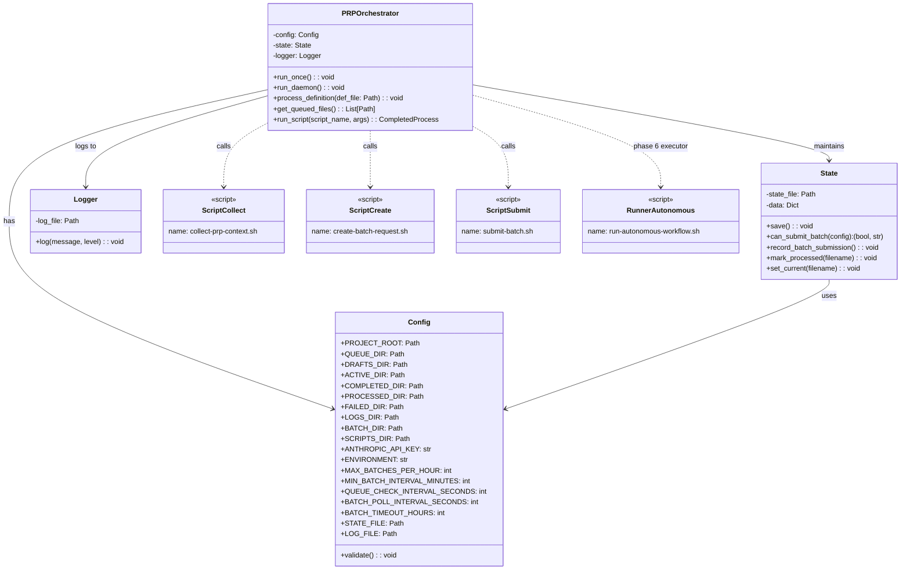
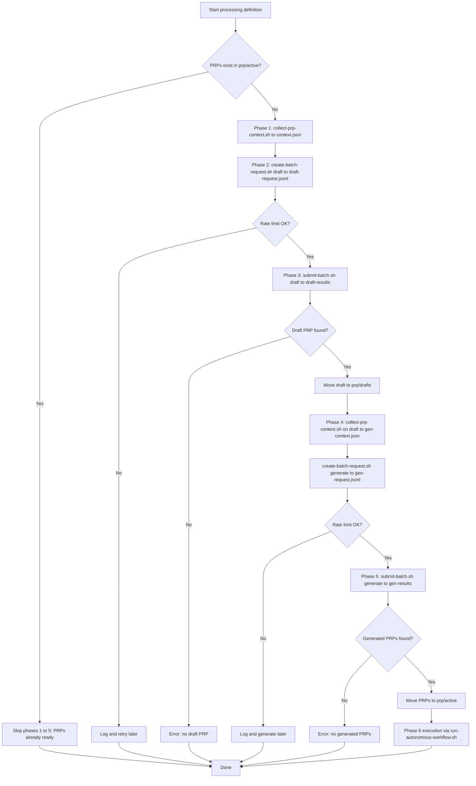
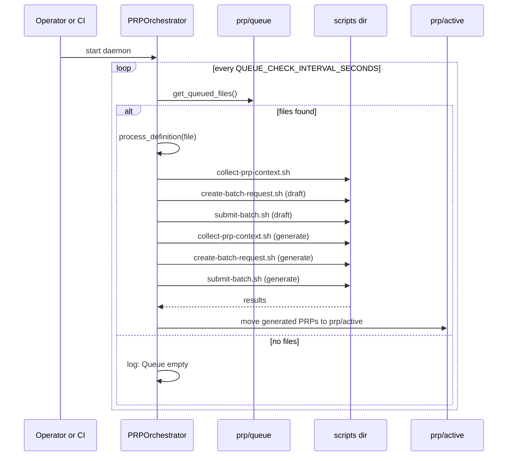

# PRP Orchestrator Architecture

This document visualizes the current Python orchestrator (`execute-prps.py`) and how it interacts with shell scripts and project folders.

## Class diagram

## Per-definition processing flow

This is the flow inside `PRPOrchestrator.process_definition(def_file)`.

## Daemon loop (queue processing)

This shows `run_daemon()` polling the queue and invoking the per-definition flow.

## Folder roles (current)

- prp/queue: Markdown definitions waiting to be processed (input to process_definition)
- batch: Temporary working outputs (context JSON, request JSONL, results folders)
- prp/drafts: Draft PRP created after the draft phase
- prp/active: Final generated PRPs, ready for execution by run-autonomous-workflow.sh
- prp/completed: Destination after execution (handled outside this script)
- prp/failed: Definitions moved here on errors, with an error txt
- logs: Orchestrator logs and state JSON
- scripts: Shell scripts invoked by the orchestrator

## Rate limiting behavior

- Enforced twice: before submitting the draft batch and before submitting the generate batch.
- State keeps a sliding window of the last hour to cap MAX_BATCHES_PER_HOUR.
- Also enforces a minimum interval (MIN_BATCH_INTERVAL_MINUTES) between submissions.
